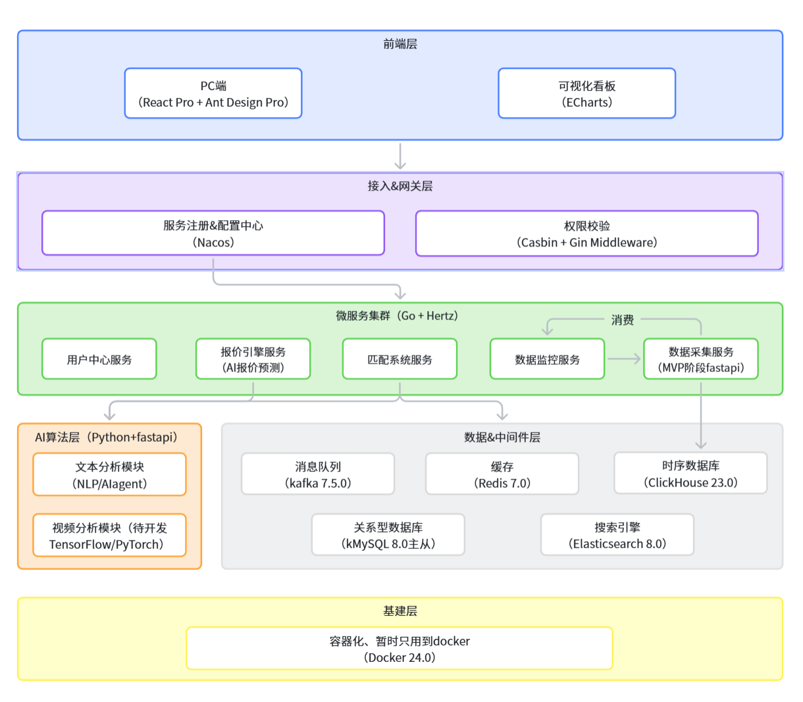

# 🚀 KOL Ads Marketing - 一站式AI赋能红人营销联盟平台


> **让每一次KOL投放都有“数”可依，有“迹”可循。**
> 
> 本项目致力于打造下一代数据驱动与AI赋能的 UGC (User Generated Content) 平台红人商业化中枢，以B站“花火”平台为体验标杆，提供从数据洞察、精准匹配、即时通讯(IM)到投后ROI分析的全链路解决方案。

---

## 💡 商业洞察与核心痛点解决 (Business Value)

传统的KOL营销往往依赖于“盲盒式”投放，缺乏多维数据支撑与科学的受众重合度分析。本项目从数据科学的视角出发，重构了KOL匹配与效果追踪的逻辑：

[//]: # (1. **多维受众重合度模型 &#40;Audience Overlap Model&#41;**)
[//]: # (开发中)
[//]: # (   - 弃用简单的标签匹配，引入基于**向量余弦相似度**的统计算法，计算红人粉丝画像与品牌方目标受众的契合度，大幅提升潜在点击率（CTR预测前置化）和转化潜力。)
1. **LLM 驱动的投后情感与商业洞察 (AIGC Insight)**
   - 接入大模型 Agent (Coze)，对海量 UGC 评论进行 NLP 文本分析（包含品牌提及率、情感倾向分类），将非结构化文本转化为可量化的品牌心智资产。
2. **毫秒级全盘数据监控 (Real-time Data Dashboard)**
   - 针对平台高优红人，利用大宽表（DWS）和 ClickHouse 强大的时序数据处理能力，实现 30/90/180 天维度商业指标的毫秒级大屏渲染。

---

## ✨ 核心技术亮点 (Technical Highlights)

本项目采用**微服务架构 (Microservices)** 构建，彻底解耦了数据采集、匹配、监控等核心业务，具备工业级的高可用性和弹性扩容能力。

### 1. 极客级别的数据采集网关 (Data Collection Service)
- **底层逻辑**：参考 [Evil0ctal 的开源实现](https://github.com/Evil0ctal/Douyin_TikTok_Download_API)，突破多平台风控（如 X-Bogus/A-Bogus 算法适配）。
- **分布式限流与调度**：基于 Redis 令牌桶算法实现严格的 API 限流，结合 Kafka 实现数据的异步清洗与流转，保障爬虫集群的高可用与防封禁策略。

### 2. 毫秒级检索引擎与匹配 (Match System Service)
- **检索引擎**：基于 `Elasticsearch 8.0` 构建红人商业标签库，支持千万级实体（红人、标签、报价）的全文检索与多维聚合。
- **无感交互 IM**：基于字节跳动开源的 `Hertz` 框架，搭建了支持高并发的即时通讯管道，为品牌方和 KOL 提供类似 B站“花火”平台的无缝对接体验。

### 3. 海量日志与数据监控中枢 (Data Monitor Service)
- **OLAP分析**：采用 `ClickHouse` 集群部署，支撑高并发的实时视频流播放追踪（投后 24/48/72 小时流量模型）。
- **冷热数据分离**：使用 `MySQL (GORM)` 配合 Redis 缓存处理高频的业务读写请求。

---

## 🏗️ 系统架构图 (System Architecture)



- **基础设施层**：Docker 容器化。
- **中间件层**：Nacos (服务注册与配置)、Kafka (消息队列/削峰填谷)、Redis (缓存与限流)。
- **数据持久层**：MySQL (主业务)、ClickHouse (时序分析)、Elasticsearch (搜索)。
- **核心服务层**：
  - `Data Collection Service` (Python FastAPI + Agent Integration)
  - `Match System Service` (Go Hertz)
  - `Data Monitor Service` (Go Hertz)

---
## ⚖️ 合规性与最佳实践声明 (Compliance & Ethics)
作为拥抱数据隐私的开发者，本项目郑重声明：

- 数据合规：本项目的数据采集模块优先对接各 UGC 平台的官方开放 API。任何爬虫技术仅限于学术研究与公开可见数据的采集，严禁用于非法获取用户隐私。开发者需严格遵守《个人信息保护法》及平台服务条款（TOS）。

- 商业透明：推荐算法的设计初衷是为了消除信息差，倡导真实、透明的 KOL 营销策略，抵制流量造假和虚假繁荣。

---
## 🤝 贡献与反馈
- 欢迎提交 Issue 和 Pull Request，共同完善这个极客视角的营销大杀器！
---

## 🚀 快速开始 (Quick Start)

### 环境要求
- Docker & Docker Compose (版本 >= 24.0)
- Go 1.25+
- Python 3.10+

### 启动步骤（开发环境）

1. **克隆项目并启动基础设施层**
   ```bash
   git clone [https://github.com/woreliedema/kol_ads_marketing.git](https://github.com/woreliedema/kol_ads_marketing.git)
   cd kol_ads_marketing/deploy
   # 启动 MySQL, Redis, Kafka, Nacos 等依赖
   docker-compose up -d